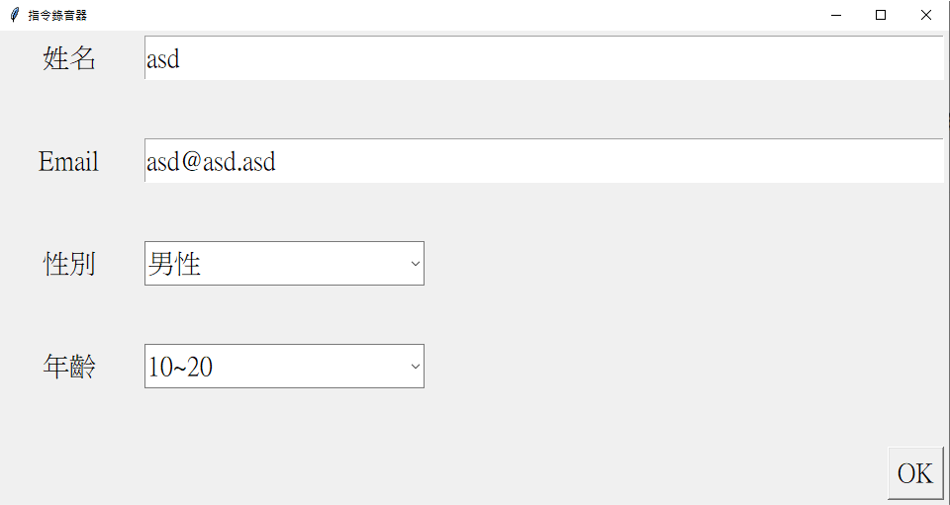
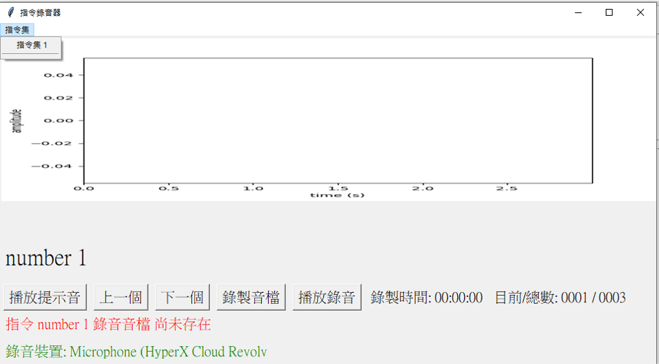

# tkinter_recoder

## A tkinter implement of audio recorder application for windows system

### 1. Enter user info then create a user folder for saving audio files

### 2. Follow the file format in command_pack2 folder to create your own record list
1. commands_1.txt format : record_text \t record_id \t sample_audio
2. wavs : folder saving sample audios

### 3. Select a command dataset and start record

